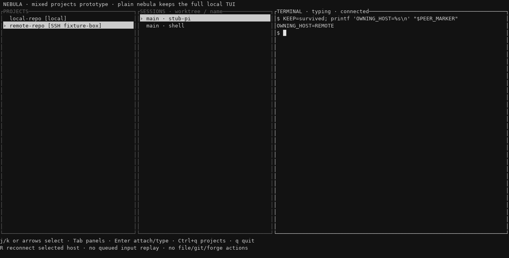
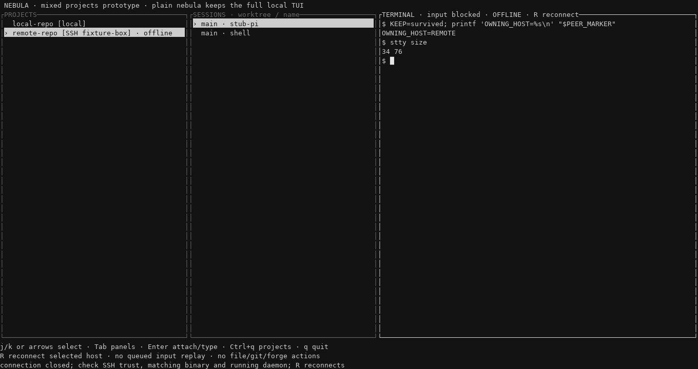

# Mixed local / SSH projects (prototype)

`nebula remote` is an **opt-in, keyboard-only** PROJECTS / SESSIONS / TERMINAL view.
It keeps local and saved SSH projects in the same list while you work in their terminals.
Plain `nebula` remains the full local TUI, unchanged.

Actual PTY integration-test renders (invented host/project names; a shell stands in for Pi):





## Build and prepare

Prerequisites: macOS or Linux, Rust/Cargo and a C compiler to build, and OpenSSH on the
viewing machine. Remote machines need the **same protocol version** and a binary with
the `_stdio` bridge from this branch, plus a running Nebula daemon. No ttyd or service
other than Nebula's existing daemon is needed.

```sh
cargo build --release --locked
cargo test -p nebula --test remote_cli --test remote_tui
cargo test -p nebula-tui remote_projects
```

Start with a disposable SSH host/user, not a client production environment. Build this
revision for that remote's platform and explicitly put its binary on the remote PATH
(`~/.local/bin` is also searched). Do not overwrite an existing installation or restart
a working daemon merely to try the prototype. Installation is an operator prerequisite:
**`nebula remote` never installs, upgrades, starts a remote daemon, or synchronizes settings.**

Using invented alias `dev-box` and checkout `/srv/app`, prepare **on the remote**:

```sh
nebula add /srv/app
nebula
```

Select that project and press `t` to create a shell terminal, or select an existing agent
session. Quit the normal TUI (`Ctrl+q`, then `q` and confirm); its daemon and sessions
stay running. A checkout registered in more than one remote workspace is ambiguous in
this prototype: use one registration for that path.

On the viewing machine, check existing SSH trust/noninteractive access yourself:

```sh
ssh -oBatchMode=yes -oStrictHostKeyChecking=yes dev-box true
```

If this fails, resolve the ordinary SSH setup first. The prototype never prompts for a
password or accepts an unknown host key inside its TUI. It uses your SSH alias/ProxyJump
configuration, disables agent/X11/port forwarding, and transfers no credentials or presets.

Prepare one local project and shell using the built binary:

```sh
./target/release/nebula add /absolute/path/to/local-repo
./target/release/nebula
# Select the project, press t; then Ctrl+q, q and confirm to leave it running.
```

## Add, open and switch

```sh
./target/release/nebula remote add dev-box /srv/app
./target/release/nebula remote list
./target/release/nebula remote
```

`add` only saves a local reference; it does not connect, create a checkout or register a
project remotely. Paths must be the exact absolute repository root shown by remote Nebula,
not a laptop path, `~` or an arbitrary worktree. `list` prints the saved references as JSON.
Private destinations live in `<Nebula data directory>/remote_projects.json`, not the repo.

Expected screen: local projects marked `[local]`, saved projects marked `[SSH dev-box]`,
a session list labeled by worktree/name, and a terminal pane. Local projects from all
local workspaces are shown. There is one SSH connection per saved remote project.

- **Projects:** `j/k` or arrows selects a row and previews its first session.
- **Enter** moves from projects to sessions, then **Enter** again enables terminal input.
- **Sessions:** `j/k` chooses another session; `Tab` returns to projects.
- **Typing:** keys go only to the attached session's owning daemon. Resize the window;
  `stty size` in a shell should report the terminal *pane's* dimensions.
- **Ctrl+q** returns to projects. Select the other project; its terminal appears without
  losing the combined list. `hostname`/`pwd` run in each shell should name its own machine/path.
- **q** in a panel closes only the view; sessions remain running on both hosts.

Create new sessions in normal Nebula on their owning machine first. There are intentionally
no file/editor/diff/GitHub actions, settings sync, cloud UI, clipboard forwarding or mouse
controls in this prototype—even on local rows. Use the owning terminal's tools or the
normal TUI instead. Remote `nebula open` events do not read matching laptop paths.

If attachment fails, the footer shows the error and terminal input is blocked. Resolve
the cause on the owning machine (for example, restore a missing agent executable), then
press **Ctrl+q** and **Enter** twice to retry the selected session and resume typing.

## Disconnect and reconnect

In a remote shell, set `KEEP=still-here`. Interrupt only the test SSH connection (for example,
briefly disable the test host's network). Allow about 15 seconds for SSH's keepalive failure.
Expect the remote row/pane to say **OFFLINE**, with input blocked if you were typing.
Press **Ctrl+q** before navigating back to local projects, which must still work. The frozen
remote screen is stale output, not evidence that its daemon or agent exited.

Restore connectivity, select the remote row and press **R** in a panel. After it connects,
press Enter twice to attach/type, then `printf '%s\n' "$KEEP"`. With the daemon and shell
still alive it should print `still-here`. Input is never queued for replay across reconnect;
reconnection does not automatically restart a daemon or session. An explicit attach to an
old agent row retains ordinary Nebula resume behavior.

If disconnected immediately, check SSH authentication, the remote binary's PATH, the running
daemon and protocol compatibility. Noninteractive shell startup must not print banners to
stdout: that channel carries binary frames. SSH stderr is not printed over the view; diagnose
with normal SSH outside it. Protocol mismatch never signals a local or remote PID.

## Cleanup / rollback

```sh
./target/release/nebula remote remove dev-box /srv/app
```

This forgets only the local reference. It deletes no remote files and stops no sessions.
Quit the prototype and use plain `nebula` to return to the existing UI. No wire/schema
migration is introduced. Keep any replaced binary backed up when provisioning a disposable
host. Only if you intentionally created a disposable daemon and want to stop **all** its
sessions, run `nebula kill` on that machine; do not use it as a reconnect remedy.

Automated tests use synthetic SSH, separate fixture daemons and real PTYs; no real remote
host or agent account is needed. See `crates/nebula/tests/remote_tui.rs` for the switching,
resize, disconnect/reconnect and wrong-host tool sentinel checks.
